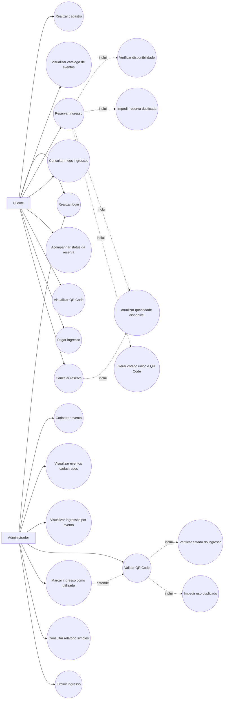
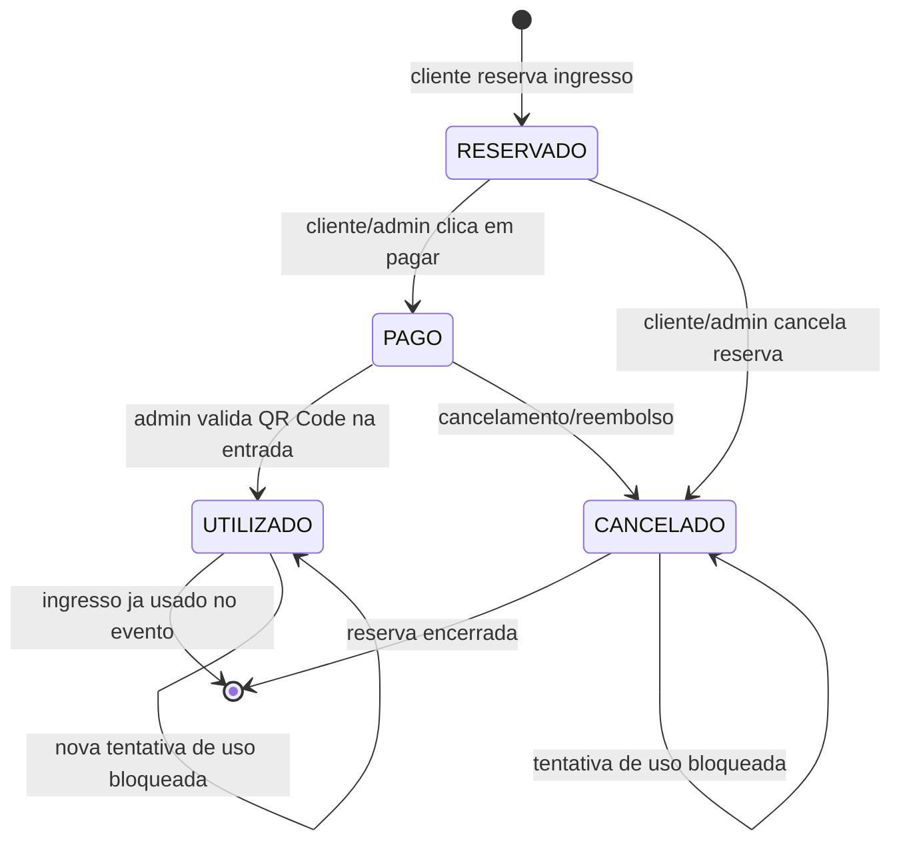
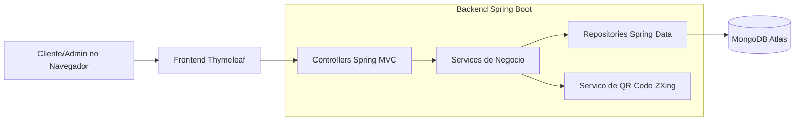

# SISTEMA WEB DE INGRESSOS COM CATALOGO DE EVENTOS, LOGIN DE CLIENTES E CONTROLE POR QR CODE

**Aluno:** Rafael Gastao  
**Disciplina:** Paradigmas de Orientacao a Objetos  
**Professor:** Informe o nome do professor  
**Instituicao:** Informe o nome da instituicao  
**Curso:** Informe o nome do curso  
**Cidade:** Informe a cidade  
**Ano:** 2026

## Resumo

Este documento apresenta a extensao de um sistema web para gerenciamento de ingressos, contemplando cadastro e catalogo de eventos, autenticacao de clientes, reserva de ingressos, geracao de QR Code e controle administrativo de entrada nos eventos. A aplicacao foi desenvolvida em Java com Spring Boot, Thymeleaf e MongoDB, seguindo conceitos de Programacao Orientada a Objetos, como encapsulamento, heranca, relacionamento entre classes e separacao de responsabilidades em camadas. A solucao permite que clientes visualizem eventos disponiveis, realizem reservas, acompanhem o estado de seus ingressos e consultem o QR Code correspondente. O administrador pode cadastrar eventos, consultar ingressos emitidos por evento, validar QR Codes e impedir o uso duplicado de ingressos.

**Palavras-chave:** Java. Spring Boot. Ingressos. QR Code. Orientacao a Objetos.

## Sumario

1. Introducao  
2. Objetivos  
3. Tecnologias utilizadas  
4. Modelagem orientada a objetos  
5. Requisitos funcionais  
6. Requisitos nao funcionais  
7. Regras de negocio  
8. Diagramas da solucao  
9. Funcionamento da aplicacao  
10. Conclusao  
11. Referencias

## 1. Introducao

O presente trabalho tem como objetivo ampliar um sistema web de venda e controle de ingressos, tornando-o mais completo e alinhado aos conceitos estudados na disciplina de Paradigmas de Orientacao a Objetos. A nova versao do sistema inclui uma area restrita para clientes, catalogo de eventos, reserva de ingressos, controle de disponibilidade e validacao de entrada por QR Code.

A proposta considera dois perfis principais de usuario: o cliente, que acessa o sistema para consultar eventos e reservar ingressos, e o administrador, responsavel pelo cadastro de eventos, acompanhamento de ingressos emitidos e validacao de entrada nos eventos.

## 2. Objetivos

### 2.1 Objetivo geral

Desenvolver uma aplicacao web orientada a objetos para gerenciamento de eventos e ingressos, com autenticacao de clientes, reserva de ingressos e controle administrativo por QR Code.

### 2.2 Objetivos especificos

- Implementar uma area do cliente com login.
- Criar um catalogo web de eventos.
- Permitir reserva de ingressos por clientes autenticados.
- Controlar a quantidade de ingressos disponiveis por evento.
- Gerar um codigo unico e um QR Code para cada ingresso.
- Permitir validacao administrativa dos ingressos.
- Impedir duplicidade de reservas indevidas e uso duplicado de ingressos.
- Organizar o codigo em camadas, separando Model, Controller, Service e Repository.

## 3. Tecnologias utilizadas

| Tecnologia | Finalidade |
| --- | --- |
| Java 17 | Linguagem principal da aplicacao. |
| Spring Boot | Estrutura principal do backend web. |
| Thymeleaf | Renderizacao das paginas HTML. |
| Spring Data MongoDB | Persistencia dos dados. |
| MongoDB Atlas | Banco de dados em nuvem. |
| Maven | Gerenciamento de dependencias e execucao do projeto. |
| ZXing | Geracao dos QR Codes dos ingressos. |
| HTML e CSS | Interface visual da aplicacao. |

## 4. Modelagem orientada a objetos

A aplicacao foi organizada utilizando conceitos de Programacao Orientada a Objetos. As classes de dominio representam os principais elementos do sistema e possuem atributos privados com metodos de acesso, demonstrando encapsulamento.

### 4.1 Principais classes

| Classe | Responsabilidade |
| --- | --- |
| `Usuario` | Representa os usuarios do sistema, incluindo dados de login e perfil. |
| `Cliente` | Representa o cliente que realiza reservas de ingressos. |
| `Evento` | Representa um evento cadastrado, com nome, descricao, data, horario, local, quantidade disponivel e valor. |
| `Ingresso` | Classe abstrata que representa um ingresso e concentra dados comuns, como evento, cliente, valor, estado e codigo QR. |
| `IngressoNormal` | Especializacao de ingresso com valor integral. |
| `IngressoMeia` | Especializacao de ingresso com desconto de meia-entrada. |
| `IngressoVIP` | Especializacao de ingresso com acrescimo no valor. |
| `Reserva` | Representa a reserva feita por um cliente para determinado evento. |
| `EstadoIngresso` | Enum que controla os estados do ingresso: RESERVADO, PAGO, CONFIRMADO, CANCELADO e UTILIZADO. |

### 4.2 Organizacao em camadas

| Camada | Responsabilidade |
| --- | --- |
| Model | Define as classes de dominio do sistema. |
| Repository | Realiza a comunicacao com o banco de dados MongoDB. |
| Service | Concentra as regras de negocio. |
| Controller | Recebe as requisicoes web e direciona as paginas. |
| Templates | Contem as paginas HTML exibidas ao usuario. |

## 5. Requisitos funcionais

| Codigo | Requisito |
| --- | --- |
| RF01 | O sistema deve permitir cadastro de clientes. |
| RF02 | O sistema deve permitir login de clientes. |
| RF03 | O sistema deve permitir login administrativo. |
| RF04 | O administrador deve cadastrar eventos com nome, descricao, data, horario, local, quantidade disponivel e valor. |
| RF05 | O cliente deve visualizar o catalogo de eventos disponiveis. |
| RF06 | O cliente deve reservar ingressos para eventos disponiveis. |
| RF07 | O cliente deve consultar os ingressos que adquiriu ou reservou. |
| RF08 | O cliente deve acompanhar o status de suas reservas. |
| RF09 | O cliente deve visualizar o QR Code correspondente ao ingresso. |
| RF10 | O sistema deve permitir pagamento ou confirmacao do ingresso. |
| RF11 | O sistema deve permitir cancelamento de reservas. |
| RF12 | O administrador deve visualizar ingressos emitidos por evento. |
| RF13 | O administrador deve validar o QR Code do ingresso. |
| RF14 | O administrador deve marcar ingresso como utilizado apos validacao. |
| RF15 | O sistema deve impedir uso duplicado do mesmo ingresso. |
| RF16 | O sistema deve apresentar relatorios simples de ingressos reservados, utilizados e disponiveis. |

## 6. Requisitos nao funcionais

| Codigo | Requisito |
| --- | --- |
| RNF01 | A aplicacao deve ser acessada por navegador web. |
| RNF02 | A aplicacao deve utilizar Java e Spring Boot. |
| RNF03 | Os dados devem ser persistidos em banco MongoDB. |
| RNF04 | A interface deve ser simples e compreensivel para cliente e administrador. |
| RNF05 | O codigo deve ser organizado em camadas. |
| RNF06 | As classes devem aplicar encapsulamento. |
| RNF07 | O QR Code deve ser unico para cada ingresso. |
| RNF08 | A aplicacao deve controlar corretamente os estados do ingresso. |

## 7. Regras de negocio

| Codigo | Regra |
| --- | --- |
| RN01 | Nao deve ser permitida reserva quando a quantidade de ingressos disponiveis for zero. |
| RN02 | Cada ingresso deve ser associado ao cliente autenticado no sistema. |
| RN03 | O mesmo cliente nao deve possuir reserva ativa duplicada para o mesmo evento. |
| RN04 | A quantidade de ingressos disponiveis deve ser reduzida automaticamente apos uma reserva. |
| RN05 | A quantidade de ingressos disponiveis deve ser aumentada quando uma reserva ativa for cancelada. |
| RN06 | Cada ingresso deve possuir um codigo unico gerado por hash. |
| RN07 | O QR Code deve representar o codigo unico do ingresso. |
| RN08 | Ingressos cancelados nao podem ser utilizados na entrada do evento. |
| RN09 | Ingressos apenas reservados devem ser pagos antes da utilizacao. |
| RN10 | Ingressos ja utilizados nao podem ser utilizados novamente. |

## 8. Diagramas da solucao

### 8.1 Diagrama de caso de uso da solucao completa

### 8.2 Diagrama de estado do ingresso

### 8.3 Diagrama de componentes do sistema

## 9. Funcionamento da aplicacao

O sistema inicia na tela principal e permite que o usuario faca login ou crie uma conta. Quando o usuario autenticado possui perfil de cliente, ele e direcionado para a area do cliente, onde pode visualizar eventos disponiveis, reservar ingressos e consultar seus ingressos.

Ao realizar uma reserva, o sistema verifica a disponibilidade do evento e impede duplicidade ativa para o mesmo cliente. Depois da reserva, a quantidade de ingressos disponiveis e atualizada automaticamente. Cada ingresso recebe um codigo unico, utilizado para gerar o QR Code.

O administrador acessa o painel administrativo para cadastrar eventos, visualizar relatorios e consultar os ingressos emitidos por evento. Na entrada do evento, o administrador pode validar o codigo do QR Code. Caso o ingresso esteja pago, ele e marcado como utilizado. Se ja tiver sido utilizado, o sistema bloqueia a duplicidade de uso.

## 10. Conclusao

A extensao do sistema permitiu aplicar conceitos fundamentais de Programacao Orientada a Objetos em uma aplicacao web funcional. A solucao contempla autenticacao, catalogo de eventos, reserva de ingressos, regras de negocio, geracao de QR Code e controle administrativo de entrada. A separacao em camadas contribuiu para uma organizacao mais clara do codigo, facilitando manutencao, reaproveitamento e evolucao da aplicacao.

## 11. Referencias

SPRING. **Spring Boot Documentation**. Disponivel em: https://spring.io/projects/spring-boot. Acesso em: 2026.

MONGODB. **MongoDB Documentation**. Disponivel em: https://www.mongodb.com/docs/. Acesso em: 2026.

ZXING. **ZXing ("Zebra Crossing") barcode scanning library for Java**. Disponivel em: https://github.com/zxing/zxing. Acesso em: 2026.

ORACLE. **Java Documentation**. Disponivel em: https://docs.oracle.com/en/java/. Acesso em: 2026.
